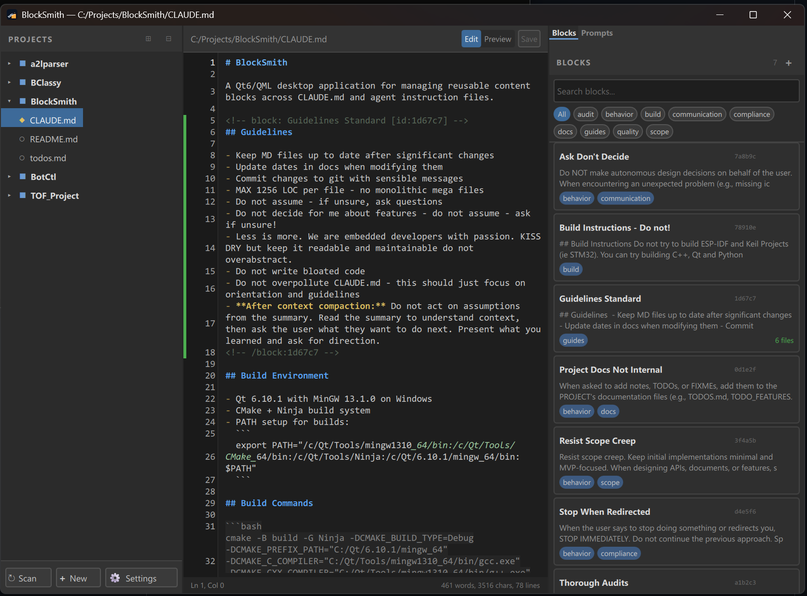

# BlockSmith

**A fast, native markdown editor for people who work with LLM agents and complex documentation.**

Edit CLAUDE.md, AGENTS.md, and any markdown file with a real editor — not a text box. Keep reusable content blocks in sync across every project. Browse Claude Code transcripts without leaving the app.

Built with **C++17 + Qt 6** (zero Electron, zero web bloat). Runs on Windows, Linux, macOS.



---

## ✨ Why BlockSmith

- **Real editor, real power.** Syntax highlighting, split view, live preview, undo/redo, find/replace. Not a glorified text box.
- **Block synchronization.** Write once, use everywhere. Push changes to all files instantly. Diverge gracefully with conflict resolution.
- **Multi-format support.** Markdown, JSON, YAML, plaintext. Syntax highlighting and format-specific toolbars for each.
- **JSONL transcripts.** Browse Claude Code .jsonl files directly — role filtering, content previews, expand entries to raw JSON.
- **Fast navigation.** Quick Switcher (Ctrl+P), document outline, global search, browser-style back/forward, project tree.
- **Export to PDF/HTML/DOCX.** Generate standalone documents with embedded images and styling.
- **Lightweight.** Native, single-window app. No web runtime, no bloat. Instant startup.

---

## 🎯 Core Features

### Markdown Editing
- **Split view** with draggable handle and auto scroll-sync
- **Live preview** with dark/light themes, mermaid diagram rendering
- **Syntax highlighting** (customizable)
- **Formatting toolbar** — H1-H3, bold, italic, strikethrough, code, lists, links, images, tables, blockquotes
- **Smart list continuation** — hit Enter to continue bullet/numbered lists
- **Auto-bracket closing** — wrap selection in [], {}, "", etc.
- **Image paste/drop** — Ctrl+V or drag from file explorer, saves to project subfolder
- **Drag image hover overlay** with visual drop feedback
- **Undo/redo toolbar** with visual buttons
- **Line number gutter** with dynamic width
- **Block markers in gutter** with sync status indicators (synced/diverged/local)

### JSON / YAML Editing
- **Syntax highlighting** (color-coded keys, strings, numbers, booleans)
- **Format JSON button** — prettify minified JSON via QJsonDocument
- **Format YAML button** — parse and re-emit via yaml-cpp (validates + prettifies)
- **YAML support** — anchors (`&name`), aliases (`*name`), tags (`!!type`), document markers

### Block System
- **Registry with JSON persistence** — blocks.db.json in app config folder
- **Create blocks** from editor selection (right-click → Add as Block)
- **Edit blocks** with split editor/preview popup and two-stage delete confirmation
- **Push block changes** to all files containing the block
- **Pull changes** from files back to registry
- **Diff view** for conflict resolution — side-by-side comparison with pull/ignore buttons
- **Diverged block highlighting** — orange border on out-of-sync blocks in right pane
- **Tag-based filtering** and full-text search on blocks
- **Insert blocks** at cursor position with one-click

### Prompt Library
- **Organize prompts** by category
- **One-click copy** to clipboard
- **Edit prompts** with split editor/preview
- **Create from selection** (right-click → Create Prompt)

### Project Discovery & Navigation
- **Configurable search paths** with ignore patterns and scan depth
- **Trigger file detection** (CLAUDE.md, AGENTS.md, .git, custom)
- **Auto-index** .md, .markdown, .json, .yaml, .yml, .jsonl, .txt, .pdf files
- **Project tree** with expand/collapse all, project/directory/file icons
- **File management** — New File, New Folder, Rename, Duplicate, Delete, Move, Reveal in Explorer
- **Delete confirmation** dialogs
- **Quick Switcher** (Ctrl+P) — fuzzy file finder with keyboard nav
- **Recent files** (last 10) in Quick Switcher
- **Document outline** — heading hierarchy H1-H6, click-to-navigate, active heading highlight
- **Global search** (Ctrl+Shift+F) — across enabled file formats, case-insensitive, line numbers
- **Back/forward navigation** — browser-style history with Alt+Left/Alt+Right + mouse side buttons

### JSONL Transcript Viewer
- **Background-threaded parsing** with chunked loading for large files
- **Role-based filtering** — user, assistant, tool, system, progress, tool_use_only
- **Text search** across entry previews
- **Expand entries** to view formatted raw JSON
- **Copy entries** to clipboard
- **Content block type detection** per Claude Messages API spec:
  - `text` — plain text content
  - `tool_use` — tool invocations with name + argument preview
  - `tool_result` — tool output (error/success)
  - `thinking` / `redacted_thinking` — extended thinking blocks
  - `image` — image attachments with media type
  - `document` — document attachments with title
  - `server_tool_use` — server-side tool calls
  - `web_search_tool_result` — web search queries + results

### File Safety
- **File watcher** — detect external changes
  - Unmodified files: auto-reload silently
  - Modified files: non-modal banner with Reload/Ignore buttons
  - Deleted files: banner with Close button
- **Auto-save** (opt-in)
  - Configurable interval (5-600 seconds, default 30)
  - Save on window focus loss
  - Status bar indicator showing "Auto-saved"
- **Save-safe file switching** — unsaved changes dialog prevents data loss
- **Dirty-buffer protection** — rename/move preserves unsaved edits via `saveTo()`

### Find & Replace
- **Find** (Ctrl+F) — navigate matches, highlight all, scroll-to-match
- **Replace** (Ctrl+H) — replace one, replace all
- **Undo-safe** — uses TextArea APIs to preserve undo stack
- **Shift+Enter** for previous match
- **Keyboard shortcuts** built-in

### Export
- **PDF** — pixel-perfect via WebEngine, A4, 15mm margins
- **HTML** — standalone HTML5 with embedded dark theme CSS
- **DOCX** — via pandoc (graceful degradation if not installed)
- **Font size selector** — Small/Medium/Large for PDF/HTML
- **Open after export** checkbox — launches file with system default app
- **Progress indicator** during export
- **Default output path** — same directory as source file

### Theme & Appearance
- **Dark and Light themes** — toggle in Settings > Editor > Theme
- **All colors in Theme singleton** — easily customizable
- **Configurable editor font** — Consolas (default) or user selection
- **Font size via Ctrl+=/Ctrl+- and Ctrl+0** to reset
- **Window geometry** and splitter width persistence
- **Status bar** — modified indicator, cursor position, encoding, auto-save status, word/char/line/reading-time stats

### Keyboard Shortcuts
| Shortcut | Action |
|----------|--------|
| Ctrl+S | Save |
| Ctrl+R | Reload from disk |
| Ctrl+E | Cycle Edit/Split/Preview |
| Ctrl+F | Find |
| Ctrl+H | Replace |
| Ctrl+Shift+F | Global search |
| Ctrl+Shift+E | Export |
| Ctrl+Shift+S / F5 | Scan projects |
| Ctrl+, | Settings |
| Ctrl+B | Bold |
| Ctrl+I | Italic |
| Ctrl+Shift+K | Inline code |
| Ctrl+D | Duplicate line |
| Tab / Shift+Tab | Indent / Outdent |
| Ctrl+P | Quick Switcher |
| Alt+Left / Alt+Right | Back / Forward navigation |
| Mouse Button 4/5 | Back / Forward navigation |
| Ctrl+W | Close file |
| Ctrl+Q | Quit |
| Ctrl+= / Ctrl+- | Zoom in / out |
| Ctrl+0 | Reset zoom |

### Claude Code Integration
- **Optional ~/.claude folder** — add to project tree via Settings > Integrations
- **Recursively indexes** .md, .markdown, .jsonl, .json, .yaml, .yml, .txt, .pdf from Claude Code
- **Auto-rescan** when integration setting changes

---

## 📊 File Format Support

| Format | Edit | Preview | Export | Toolbar |
|--------|------|---------|--------|---------|
| Markdown (.md, .markdown) | ✓ | ✓ | ✓ | ✓ |
| JSON (.json) | ✓ | — | — | ✓ (Format) |
| YAML (.yaml, .yml) | ✓ | — | — | ✓ (Format) |
| JSONL (.jsonl) | Special viewer | — | — | — |
| Plaintext (.txt) | ✓ | — | — | — |
| PDF (.pdf) | Read-only | ✓ (WebEngine) | — | — |

---

## 🔧 Settings

All settings stored in `QStandardPaths::AppConfigLocation`:
- Windows: `%LOCALAPPDATA%/BlockSmith`
- Linux: `~/.local/share/BlockSmith`
- macOS: `~/Library/Application Support/BlockSmith`

### Project Settings
- Search paths (comma-separated)
- Ignore patterns (glob style)
- Trigger files (detect projects)
- Scan depth
- Auto-scan on startup
- Include Claude Code folder

### Editor Settings
- Theme (dark / light)
- Font family
- Syntax highlighting toggle
- Word wrap toggle
- Image subfolder

### Integration Settings
- Claude Code folder toggle

### Auto-save Settings
- Enable/disable
- Interval (5-600 seconds)

---

## 🚀 Performance

- **Instant startup** — native C++ app, <100ms to first frame
- **Responsive UI** — all file I/O off main thread
- **Handles large files** — tested with 50MB+ transcripts
- **Async project scan** — doesn't block UI while indexing
- **Async search** — cancellable with progress indicator

---

## 🛠️ Build from Source

### Requirements
- **Qt 6.10.1** or later (with WebEngine, WebChannel, Concurrent modules)
- **CMake 3.21+**
- **C++17 compiler** (MSVC 2022, GCC 11+, Clang 14+)
- **Windows:** Visual Studio Build Tools 2022
- **Linux:** gcc-11+, Qt6 dev packages
- **macOS:** Xcode 13+

### Build Steps

**Windows (MSVC):**
```bash
# Uses build_msvc.bat which sets up environment
cmd.exe //c "C:\Projects\BlockSmith\build_msvc.bat"
```

**Linux/macOS:**
```bash
cmake -B build -G Ninja -DCMAKE_BUILD_TYPE=Release -DCMAKE_PREFIX_PATH="/path/to/qt6"
cmake --build build
```

---

## 📥 Download

Grab the latest release from [GitHub Releases](https://github.com/bcodesnow/BlockSmith/releases).

**Coming soon:** Installers for Windows, Linux, macOS.

---

## 📖 Documentation

- **[User Manual](docs/user-manual.md)** — Detailed shortcuts, workflows, settings
- **[Architecture](docs/architecture.md)** — Project structure, code organization, data formats
- **[Roadmap](docs/ROADMAP.md)** — Planned features and future phases

---

## 🐛 Known Limitations

- **No remote file sync** — local files only
- **Single editor instance** — Phase 13 will add tabs
- **No git integration yet** — Phase 16 planned
- **Pandoc required for DOCX export** — gracefully falls back to other formats

---

## 🤝 Contributing

BlockSmith is written in C++17 (backend) and QML (UI). If you'd like to contribute:

1. Read [CLAUDE.md](CLAUDE.md) for project guidelines
2. Review current technical-debt notes in the roadmap and open issues
3. See [docs/ROADMAP.md](docs/ROADMAP.md) for planned work

Code must pass:
- Zero compiler warnings (MSVC /W4, GCC -Wall -Wextra -Wpedantic)
- Max 1256 LOC per file
- Sensible git commit messages

---

## 📜 License

**GPLv3** — See [LICENSE](LICENSE)

Copyright © 2026 Danube Mechatronics Kft.

**Authors:** kb (kb@danube-mechatronics.com) & Claude (Anthropic)

---

## 💬 Feedback & Issues

Found a bug? Have a feature request?

File an issue on [GitHub Issues](https://github.com/bcodesnow/BlockSmith/issues).

---

## 🌟 What's Next

- **Multi-tab editor** — open multiple files simultaneously
- **Git integration** — status icons, diff view, commit from the app
- **Spell checking** — Hunspell or system API with red squiggles
- **DOCX viewer** — read-only preview for Word documents

See the full roadmap in [docs/ROADMAP.md](docs/ROADMAP.md).
